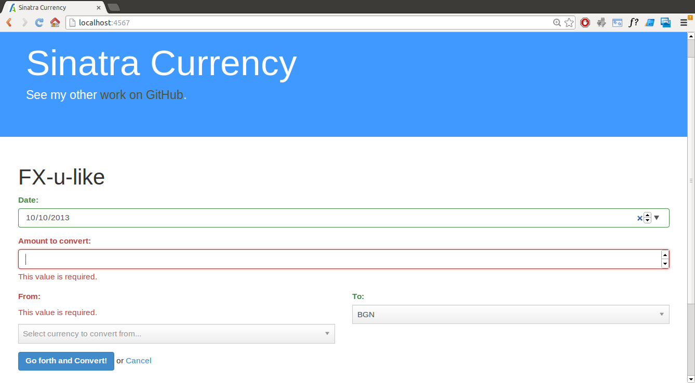

sinatra-currency
================

Simple app demonstrating 

  - [Sinatra](http://www.sinatrarb.com/)
  - [HAML](http://haml.info/) - embedded Sinatra templates
  - [MongoDB](http://www.mongodb.org/) - overkill, but for demonstration purposes
  - [RubyMoney](https://github.com/RubyMoney/money)
  - [Twitter Bootstrap 3.0](http://getbootstrap.com/)
  - [Chosen](http://harvesthq.github.io/chosen/)
  - [Parsley.js](http://parsleyjs.org/)

## Requirements

  - Ruby
  - MongoDB

## Running

First, dump the rates from [http://www.ecb.europa.eu/stats/eurofxref/eurofxref-hist-90d.xml](http://www.ecb.europa.eu/stats/eurofxref/eurofxref-hist-90d.xml) to MongoDB:

`ruby dump_rates.rb`

Then start the actual app:

`ruby app.rb`

Next, point your browser to [http://localhost:4567](http://localhost:4567).

## Todo

  - Write tests!

# Screenshots

